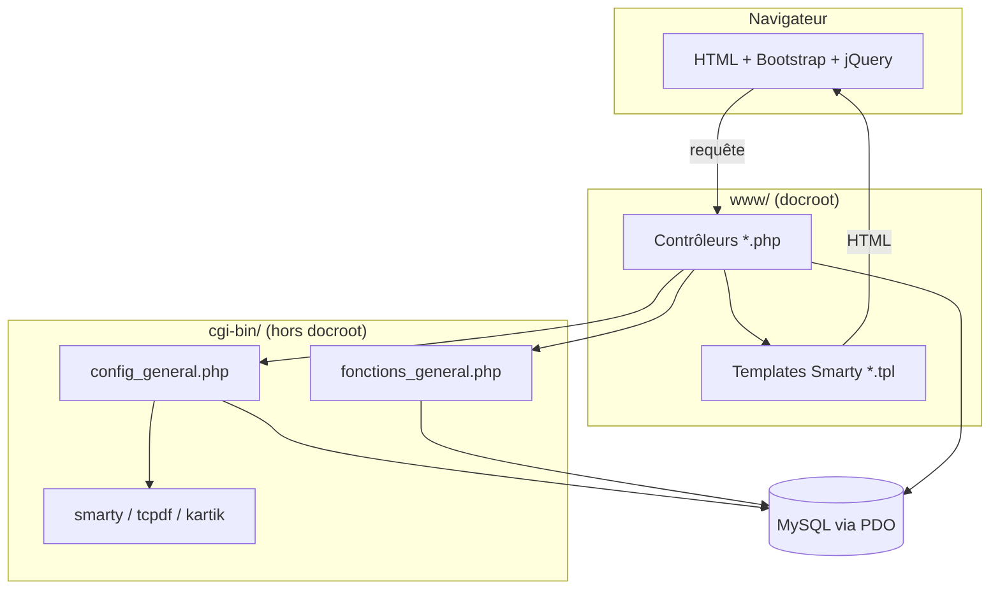
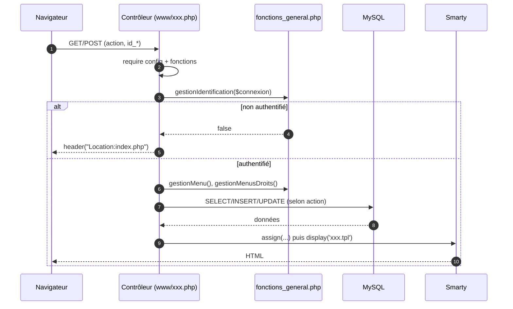
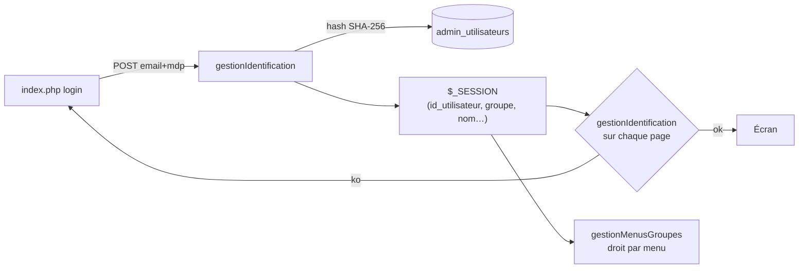

# Architecture

## Vue d'ensemble

Application PHP procédurale suivant un découpage **contrôleur → modèle (SQL en
ligne) → vue (Smarty)**, sans framework. Il n'y a pas de routeur : chaque URL
correspond à un fichier `.php` de `www/`.



## Amorçage (bootstrap)

Tout contrôleur commence par :

```php
require_once('../cgi-bin/config/config_general.php');   // session_start(), PDO $connexion, objet $smarty
require_once('../cgi-bin/config/fonctions_general.php'); // fonctions Gestion*
```

`config_general.php` :
- démarre la session (`session_start()`) ;
- instancie **Smarty** avec les délimiteurs personnalisés `<!--{` et `}-->`
  (les répertoires `templates/`, `templates_c/`, `configs/`, `cache/`) ;
- ouvre la **connexion PDO** MySQL à partir des constantes `utilisateur`, `mdp`,
  `serveur`, `bdd` (variable `$connexion`, en `SET NAMES UTF8`).

## Cycle de vie d'une requête



## Fonctions transverses (`fonctions_general.php`)

| Fonction | Rôle |
|----------|------|
| `GestionHashage($mdp)` | Hache un mot de passe en SHA-256 avec un sel statique (préfixe + suffixe codés en dur). |
| `GestionIdentification($connexion)` | Authentifie via `$_POST["email"]`/`$_POST["mdp"]`, remplit `$_SESSION` (utilisateur, groupe, droits). Renvoie `true`/`false`. |
| `GestionMenu($connexion)` | Charge les items de menu depuis `admin_menu` (ordonnés). |
| `GestionMenusDroits($connexion)` | Détermine le droit de l'utilisateur sur le menu courant (`admin_menus_groupes`). |
| `GestionDate($date, $mode)` | Convertit entre `Y-m-d` (BDD) et `d-m-Y` (affichage). |
| `GestionPagination(...)` / `GestionPaginationReservations(...)` | Calcule le nombre de pages selon `items_par_page`. |
| `GestionSuppression(...)` | **Soft-delete** : passe `id_etat` à 1 (activer) / 2 (archiver) / 3 (supprimer). |
| `GestionTri(...)` | Mémorise/restaure colonne, sens de tri et `items_par_page` **par utilisateur et par menu** (`admin_utilisateurs_session`). |
| `DupliquerSessionUtilisateur(...)` | Copie les préférences d'affichage d'un utilisateur vers un autre. |
| `GestionUtilisateursEtats($groupe)` | Mappe un groupe vers les états visibles (1 → actif seul, 2 → actif+archivé, 1 → tout=99). |

## Authentification & droits



- **Groupes** (`admin_utilisateurs_groupes`) : `1` = super-admin (voit tout),
  `2` = actif + archivé, `3` = actif seulement (cf. `GestionUtilisateursEtats`).
- Les **droits par menu** sont dans `admin_menus_groupes`
  (`id_utilisateur_groupe`, `id_admin_menu`, `droit`).
- La déconnexion (`index.php`) détruit la session.

## Vues (Smarty)

- Templates dans `www/templates/*.tpl`, compilés dans `templates_c/`.
- **Délimiteurs personnalisés** : `<!--{ variable }-->` au lieu de `{ }`
  (pour cohabiter avec le JS/CSS entre accolades).
- Fragments communs : `header.tpl`, `header-cdn.tpl`, `header_mdp.tpl`,
  `footer.tpl`.

## Impressions PDF

Les pages `www/impressions_*.php` (10 écrans) génèrent des documents via
**TCPDF** (`cgi-bin/tcpdf/`) : reçus de règlement, listes des réservations du
jour, bordereaux de départ/retour, adhésions par exercice, etc. Certaines sont
appelées automatiquement (liens envoyés par le cron).

## Découpage prod / recette

Le dépôt contient deux copies complètes du code (`www/` + `cgi-bin/` pour la
prod, `recette/www/` + `recette/cgi-bin/` pour la recette). Elles ne diffèrent
que par la configuration de connexion. **Toute évolution fonctionnelle doit être
répercutée dans les deux**, sauf intention contraire explicite.
