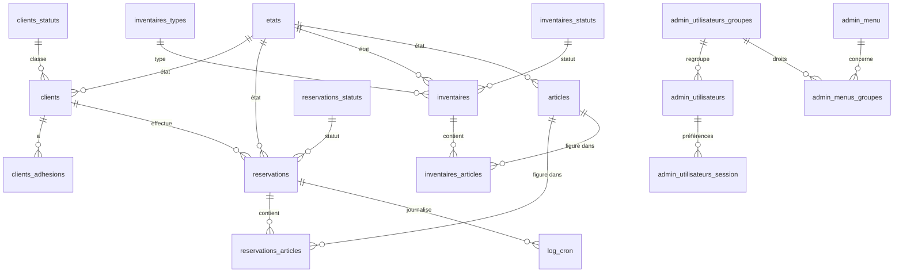

# Base de données

> ⚠️ Il n'existe pas de dump SQL dans le dépôt. Ce document est **reconstitué à
> partir des requêtes** présentes dans le code (`INSERT`/`SELECT`/`UPDATE`). Les
> types de colonnes sont déduits, pas garantis. Compléter si un schéma officiel
> est retrouvé.

## Tables recensées

Extraites des requêtes SQL du code applicatif :

**Métier**
- `clients` — adhérents / clients
- `clients_adhesions` — adhésions annuelles (montant par année)
- `clients_statuts` — statuts de client
- `clients_import` — table de travail pour l'import initial
- `articles` — catalogue d'articles (matériel)
- `inventaires` — fiches d'inventaire
- `inventaires_articles` — lignes d'inventaire (article × quantité)
- `inventaires_types` — types d'inventaire
- `inventaires_statuts` — statuts d'inventaire
- `reservations` — réservations de matériel
- `reservations_articles` — lignes de réservation (article × quantité)
- `reservations_statuts` — statuts de réservation
- `reservations_test`, `reservations_test_avec_id` — tables de test/bac à sable
- `fichiers` — pièces jointes téléversées

**Transverse / administration**
- `etats` — états génériques (1=actif, 2=archivé, 3=supprimé)
- `admin_menu` — items de menu de l'application
- `admin_menus_groupes` — droits d'un groupe sur un menu
- `admin_utilisateurs` — comptes utilisateurs
- `admin_utilisateurs_groupes` — groupes d'utilisateurs
- `admin_utilisateurs_session` — préférences d'affichage (colonnes, tri, pagination) par utilisateur et par menu
- `log_cron` — journal des exécutions de la tâche planifiée

## Modèle relationnel (déduit)

## Colonnes principales (d'après les `INSERT`)

### `clients`
`id_client` (PK), `association`, `nom`, `prenom`, `adresse1`, `adresse2`,
`adresse3`, `cp`, `ville`, `telephone`, `email`, `commentaire`, `cle_client`,
`date_creation`, `date_modification`, `id_etat`, `id_statut_client`,
`id_membre_auteur`.

### `clients_adhesions`
`id_client`, `annee`, `montant`, `date_creation`, `date_modification`,
`id_membre_auteur`.

### `articles`
`id_article` (PK), `designation`, `commentaire`, `date_creation`,
`date_modification`, `id_etat`, `ordre_article`, `id_membre_auteur`.

### `reservations`
`id_reservation` (PK), `id_client`, `commentaire`, `don`, `date_don`,
`date_depart`, `date_retour`, `date_creation`, `date_modification`,
`heure_modification`, `annee_reservation`, `id_etat`, `id_statut_reservation`,
`id_membre_auteur`.

### `reservations_articles`
`id_reservation`, `id_article`, `quantite_reservee`, `id_membre_auteur`.

### `inventaires`
`id_inventaire` (PK), `commentaire`, `date_inventaire`, `date_creation`,
`date_modification`, `id_statut_inventaire`, `id_type_inventaire`, `id_etat`,
`id_membre_auteur`.

### `admin_utilisateurs`
`id_utilisateur` (PK), `id_utilisateur_groupe`, `prenom_utilisateur`,
`nom_utilisateur`, `email_utilisateur`, `mdp_utilisateur` (SHA-256 salé),
`items_par_page`.

### `admin_utilisateurs_session`
`id_utilisateur`, `id_admin_menu`, `colonne`, `colonne_titre_fr`, `largeur`,
`ordre`, `sens_tri`, `tri_utilisateur`, `items_par_page`.

### `admin_menu`
`id_admin_menu` (PK), `titre_fr`, `url`, `niveau`, `id_parent`, `ordre`.

### `log_cron`
`date`, `id_reservation`.

## Conventions de schéma

- **Clés primaires** : `id_<table_au_singulier>` (ex. `id_client`).
- **Clés étrangères** : même nom que la PK cible (ex. `id_client` dans
  `reservations`).
- **Audit** sur les tables métier : `date_creation`, `date_modification`,
  `id_membre_auteur` (utilisateur ayant fait la dernière modification).
- **État** : colonne `id_etat` référencée sur `etats`
  (`1`=actif, `2`=archivé, `3`=supprimé) → mécanisme de **soft-delete**.
- **Statuts métier** dédiés par entité : `clients_statuts`,
  `reservations_statuts`, `inventaires_statuts` (distincts de `id_etat`).
