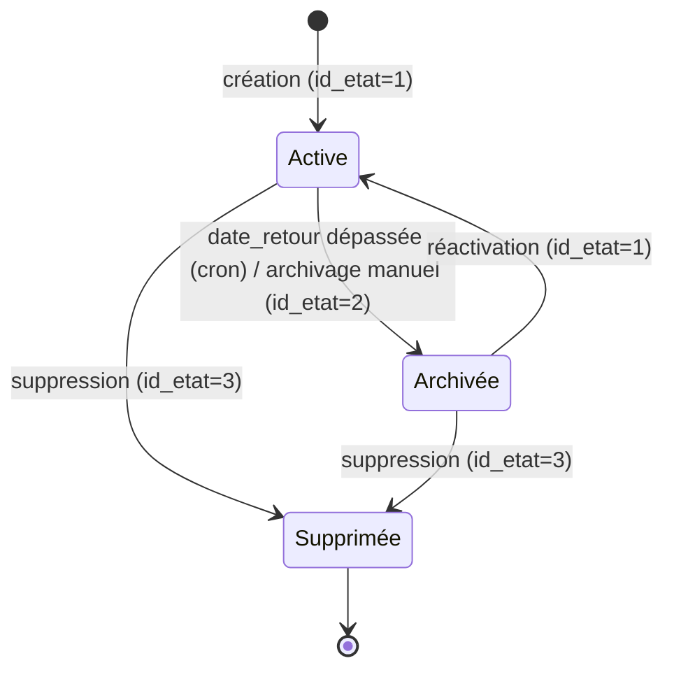
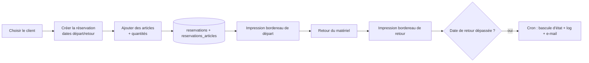

# Domaine métier

L'application sert un **comité des fêtes** : une association qui gère des
adhérents et **prête/loue du matériel** (tables, chaises, vaisselle, etc.) lors
d'événements. Voici le vocabulaire et les processus.

## Concepts

| Terme | Signification |
|-------|---------------|
| **Client / adhérent** | Personne ou association bénéficiaire. Identifiée par une `cle_client` unique. |
| **Adhésion** | Cotisation annuelle d'un client (`annee`, `montant`). Un client peut avoir plusieurs adhésions (une par exercice). |
| **Article** | Type de matériel prêtable (`designation`), ordonnable dans les listes (`ordre_article`). |
| **Inventaire** | Fiche de recensement du stock à une date, composée de lignes `article × quantité`, avec un type et un statut. |
| **Réservation** | Demande d'un client portant sur des articles (quantités), avec **date de départ** et **date de retour**, un éventuel **don**, un statut et un cycle de vie. |
| **Règlement** | Paiement (adhésion et/ou don). Les écrans `impressions_reglements_*` éditent reçus et détails. |
| **Don** | Montant offert au comité, rattaché à une réservation (`don`, `date_don`). |
| **Exercice** | Année de référence (`annee_reservation`, `annee` d'adhésion). |
| **Membre auteur** | Utilisateur connecté ayant créé/modifié la donnée (`id_membre_auteur`). |

## Cycle de vie d'une réservation

Deux dimensions coexistent :

- **`id_etat`** (technique, commun à toutes les tables) : actif / archivé / supprimé.
- **`id_statut_reservation`** (métier) : statuts propres au processus de prêt.

La **tâche planifiée** fait évoluer automatiquement l'état des réservations
lorsque la **date de retour** est dépassée.

> Note : l'état est manipulé par `gestionSuppression()` ; aucune ligne métier
> n'est réellement effacée (soft-delete).

## Processus principaux

### Adhésion annuelle

### Réservation de matériel

## Écrans (contrôleurs) par domaine

| Domaine | Fichiers `www/` |
|---------|-----------------|
| Accueil / connexion | `accueil.php`, `index.php`, `mdp_perdu.php`, `mdp_reinitialiser.php` |
| Clients | `clients_liste.php`, `clients_formulaire.php`, `fiche_client.php` |
| Articles | `articles_liste.php`, `articles_formulaire.php` |
| Inventaires | `inventaires_liste.php`, `inventaires_formulaire.php`, `fiche_inventaire.php` |
| Réservations | `reservations_liste.php`, `reservations_formulaire.php`, `fiche_reservation.php`, `fiche_reservation_client.php`, `confirmation_reservation.php`, `reservation_confirmation.php` |
| Pièces jointes | `fichier_ajouter.php`, `fichier_supprimer.php` |
| Impressions (PDF) | `impressions.php`, `impressions_adhesions_exercice.php`, `impressions_articles_jour.php`, `impressions_reglements_detail.php`, `impressions_reglements_recus.php`, `impressions_reservations_jour.php`, `impressions_reservations_retour.php`, `impressions_reservations_sans_adhesions.php`, `impressions_reservations_sans_dons.php`, `impressions_automatique_reservations_jour.php` |
| Administration | `admin_utilisateurs_liste.php`, `admin_utilisateurs_formulaire.php`, `admin_utilisateurs_groupes_liste.php`, `admin_utilisateurs_groupes_formulaire.php` |

> Les fichiers préfixés par `_` (ex. `_cle_unique_clients.php`,
> `_reservations_import.php`) ou nommés `example_*`, `test-*`, `index-test.php`
> sont des **scripts ponctuels / de test**, pas des écrans de production.
