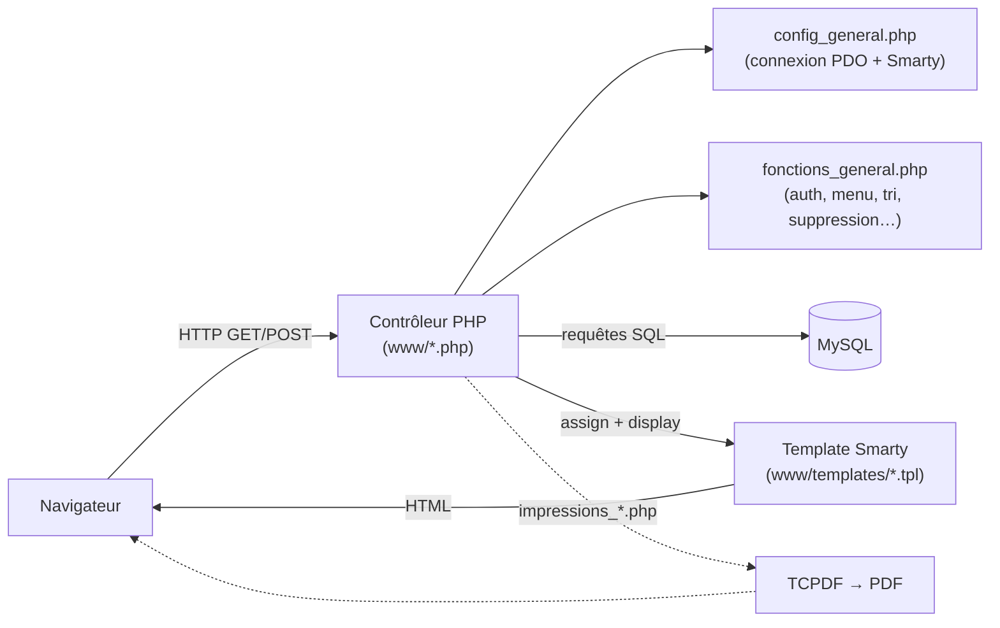
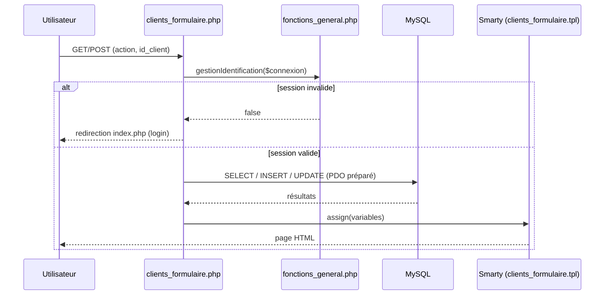

# Comité des Fêtes — Application de gestion

Application web de gestion pour le **Comité des Fêtes de Genay** : gestion des
adhérents, des adhésions annuelles, de l'inventaire du matériel, et des
**réservations de matériel** (prêt/location), avec édition de documents PDF
(reçus, bordereaux de départ et de retour, listes du jour).

> ℹ️ Application « maison », en PHP procédural + Smarty, historiquement hébergée
> sur un mutualisé **OVH** (PHP 7.2, MySQL). Les libellés, la base de données et
> l'interface sont **en français**.

---

## Sommaire

- [Fonctionnalités](#fonctionnalités)
- [Pile technique](#pile-technique)
- [Architecture](#architecture)
- [Structure du dépôt](#structure-du-dépôt)
- [Développement avec Docker](#développement-avec-docker)
- [Installation locale](#installation-locale)
- [Configuration](#configuration)
- [Environnements (prod / recette)](#environnements-prod--recette)
- [Tâche planifiée (cron)](#tâche-planifiée-cron)
- [Sécurité — points d'attention](#sécurité--points-dattention)
- [Documentation détaillée](#documentation-détaillée)

---

## Fonctionnalités

- **Clients / adhérents** : fiche client, coordonnées, statut, clé unique.
- **Adhésions** : adhésions annuelles avec montant, par client.
- **Articles & inventaire** : catalogue d'articles, fiches d'inventaire
  (types et statuts) recensant les quantités de matériel.
- **Réservations** : réservation d'articles par un client, avec date de départ
  et de retour, quantités, don éventuel, statut et cycle de vie.
- **Impressions PDF** (TCPDF) : reçus de règlement, listes des réservations du
  jour, bordereaux de retour, adhésions par exercice, etc.
- **Administration** : utilisateurs, groupes et droits par menu ; menu piloté
  par la base de données.
- **Confort d'usage** : colonnes de liste, tri et pagination **mémorisés par
  utilisateur et par écran**.
- **Envoi d'e-mails** : mot de passe perdu, notifications de la tâche planifiée.

## Pile technique

| Domaine         | Choix                                                                     |
|-----------------|---------------------------------------------------------------------------|
| Langage         | PHP 7.2 (procédural)                                                      |
| Base de données | MySQL (PDO)                                                               |
| Templating      | [Smarty](https://www.smarty.net/) (délimiteurs `<!--{ }-->`)              |
| PDF             | [TCPDF](https://tcpdf.org/)                                               |
| Front           | Bootstrap 4.1.3, FontAwesome 4.7, jQuery, Popper                          |
| Composants      | gijgo (calendriers), Kartik, bootstrap-fileinput, TinyMCE, jQuery-Confirm |
| Hébergement     | OVH mutualisé (`.ovhconfig`, `app.engine=php` 7.2)                        |

## Architecture

Chaque écran suit le même triptyque : un **contrôleur PHP** dans `www/` traite la
requête et interroge la base via PDO, puis délègue l'affichage à un **template
Smarty** de `www/templates/`. La configuration et les fonctions transverses sont
centralisées dans `cgi-bin/config/`.



Cycle de vie d'une requête sur un écran type (ex. fiche client) :



## Structure du dépôt

```
cms/
├── www/                     # Racine web PROD (docroot OVH)
│   ├── *.php                # Contrôleurs (accueil, clients, réservations, impressions…)
│   ├── templates/           # Vues Smarty (.tpl)
│   ├── templates_c/         # Cache de compilation Smarty (généré)
│   ├── cache/ configs/      # Cache et configs Smarty
│   ├── css/ js/ images/     # Ressources statiques
│   ├── bootstrap/ fontawesome/ gijgo/ kartik/  # Bibliothèques front
│   ├── fichiers/            # Pièces jointes téléversées
│   └── fichiers_importation_initiale/  # Scripts d'import ponctuels
├── cgi-bin/                 # Code hors docroot
│   ├── config/
│   │   ├── config_general.php    # Connexion BDD (PDO) + init Smarty
│   │   └── fonctions_general.php # Fonctions transverses
│   ├── reservations_maj_automatique.php  # Tâche planifiée (cron)
│   ├── smarty/ tcpdf/ kartik/ Charts/    # Bibliothèques PHP
├── recette/                 # Copie complète de l'environnement de RECETTE
│   ├── www/
│   └── cgi-bin/
├── sources/                 # Archives .zip des bibliothèques tierces
└── .ovhconfig               # Configuration hébergement OVH
```

## Développement avec Docker

Un environnement Docker Compose reproduit l'hébergement OVH (PHP 7.2 + MySQL) et
sert **les deux environnements en parallèle** (production et recette), chacun avec
sa propre base de données, plus un **phpMyAdmin** unique pour les consulter. Le
dossier courant est monté dans les conteneurs : le code est modifiable à chaud.

```bash
./docker/build.sh      # construit l'image web (contourne une limite de BuildKit)
docker compose up -d   # démarre les 5 services
```

| Service | Accès |
|---------|-------|
| Application **prod** | http://localhost:8080 (base `comitefetes`) |
| Application **recette** | http://localhost:8081 (base `comitefetesrecette`) |
| **phpMyAdmin** | http://localhost:8082 (serveurs *Production* / *Recette*, login `root` / `root`) |

Pour recréer les bases, déposer un export SQL dans `docker/initdb/prod/` et
`docker/initdb/recette/` (importé automatiquement au premier démarrage).

> 📖 Détails, commandes utiles et dépannage : [`docker/README.md`](docker/README.md)
> et [`docker/initdb/README.md`](docker/initdb/README.md).

## Installation locale

> Alternative sans Docker. Prérequis : PHP 7.2+ avec l'extension PDO MySQL, un
> serveur MySQL, un serveur web (Apache) dont la racine pointe sur `www/`.

1. Créer une base MySQL locale (par défaut `comitefetes`).
2. Renseigner la connexion dans `cgi-bin/config/config_general.php`
   (voir [Configuration](#configuration)).
3. Servir le dossier `www/` et ouvrir `index.php`.

> ⚠️ Le dépôt ne contient pas de dump SQL du schéma. Les structures de tables
> doivent être reconstituées à partir des requêtes (voir
> [`docs/base-de-donnees.md`](docs/base-de-donnees.md)) ou
> importées depuis une base existante.

## Configuration

La connexion à la base et l'initialisation de Smarty se font dans
`cgi-bin/config/config_general.php` via des constantes :

```php
define('utilisateur', "…");   // utilisateur MySQL
define('mdp',         "…");   // mot de passe MySQL
define('serveur',     "…");   // hôte MySQL
define('bdd',         "…");   // nom de la base
```

## Environnements (prod / recette)

Le dépôt embarque **deux copies** de l'application :

- `www/` + `cgi-bin/` : **production** (base `cdfgenaytbbdd` sur OVH).
- `recette/www/` + `recette/cgi-bin/` : **recette** (base `cdfrecette` sur
  l'instance cloud OVH).

Les deux partagent le même code ; seule la configuration (base, hôte) diffère.

## Tâche planifiée (cron)

`cgi-bin/reservations_maj_automatique.php` est destiné à être appelé
quotidiennement (cron OVH). Il :

1. bascule l'état des réservations dont la **date de retour est dépassée** ;
2. journalise chaque mise à jour dans la table `log_cron` ;
3. envoie un e-mail récapitulatif avec les liens vers les PDF du jour
   (départs et retours).

## Sécurité — points d'attention

> 🔒 À traiter **avant toute publication** du dépôt (surtout s'il devient public).

- **Identifiants de base en clair** dans `config_general.php` et
  `reservations_maj_automatique.php` (prod + recette). À externaliser
  (fichier de config ignoré par git + modèle `.dist`) et à **renouveler**.
- **Hachage des mots de passe** : SHA-256 avec sel statique codé en dur
  (`fonctions_general.php`). À migrer vers `password_hash()` / `password_verify()`.
- **Requêtes SQL** : une partie utilise des requêtes préparées (PDO), mais
  plusieurs concaténations de variables de session/entrées existent — à auditer
  contre l'injection SQL.

## Documentation détaillée

La documentation complète se trouve dans le dossier [`docs/`](docs/README.md) :

- [`architecture.md`](docs/architecture.md) — comment l'application est construite : flux d'une requête, authentification, templates, PDF.
- [`base-de-donnees.md`](docs/base-de-donnees.md) — les tables, leurs relations et leurs colonnes.
- [`domaine-metier.md`](docs/domaine-metier.md) — le vocabulaire et les processus métier.
- [`conventions.md`](docs/conventions.md) — les conventions de code du projet.
