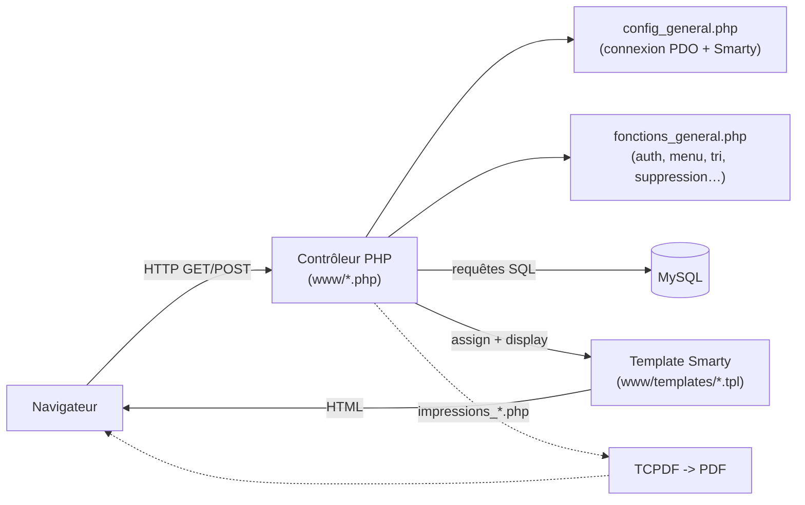
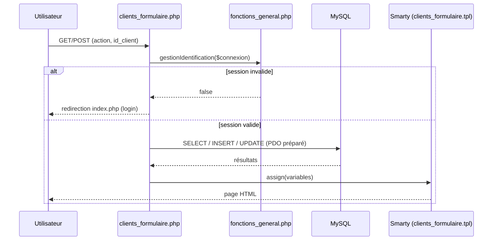

# Comité des Fêtes — Application de gestion

Application web de gestion pour le **Comité des Fêtes de Genay** : gestion des
adhérents, des adhésions annuelles, de l'inventaire du matériel, et des
**réservations de matériel** (prêt/location), avec édition de documents PDF
(reçus, bordereaux de départ et de retour, listes du jour).

> ℹ️ Application « maison », en PHP procédural + Smarty, historiquement hébergée
> sur un mutualisé **OVH** (PHP 7.2, MySQL). Les libellés, la base de données et
> l'interface sont **en français**.

---

## Sommaire

- [Fonctionnalités](#fonctionnalités)
- [Pile technique](#pile-technique)
- [Architecture](#architecture)
- [Structure du dépôt](#structure-du-dépôt)
- [Développement avec Docker](#développement-avec-docker)
- [Installation locale](#installation-locale)
- [Configuration](#configuration)
- [Environnements (prod / recette / test / local)](#environnements-prod--recette--test--local)
- [Tâche planifiée (cron)](#tâche-planifiée-cron)
- [Sécurité — points d'attention](#sécurité--points-dattention)
- [Documentation détaillée](#documentation-détaillée)

---

## Fonctionnalités

- **Clients / adhérents** : fiche client, coordonnées, statut, clé unique.
- **Adhésions** : adhésions annuelles avec montant, par client.
- **Articles et inventaire** : catalogue d'articles, fiches d'inventaire
  (types et statuts) recensant les quantités de matériel.
- **Réservations** : réservation d'articles par un client, avec date de départ
  et de retour, quantités, don éventuel, statut et cycle de vie.
- **Impressions PDF** (TCPDF) : reçus de règlement, listes des réservations du
  jour, bordereaux de retour, adhésions par exercice, etc.
- **Administration** : utilisateurs, groupes et droits par menu ; menu piloté
  par la base de données.
- **Confort d'usage** : colonnes de liste, tri et pagination **mémorisés par
  utilisateur et par écran**.
- **Envoi d'e-mails** : mot de passe perdu, notifications de la tâche planifiée.

## Pile technique

| Domaine         | Choix                                                                     |
|-----------------|---------------------------------------------------------------------------|
| Langage         | PHP 7.2 (procédural)                                                      |
| Base de données | MySQL (PDO)                                                               |
| Templating      | [Smarty](https://www.smarty.net/) (délimiteurs `<!--{ }-->`)              |
| PDF             | [TCPDF](https://tcpdf.org/)                                               |
| Front           | Bootstrap 4.1.3, FontAwesome 4.7, jQuery, Popper                          |
| Composants      | gijgo (calendriers), Kartik, bootstrap-fileinput, TinyMCE, jQuery-Confirm |
| Hébergement     | OVH mutualisé (`.ovhconfig`, `app.engine=php` 7.2)                        |

## Architecture

Chaque écran suit le même triptyque : un **contrôleur PHP** dans `www/` traite la
requête et interroge la base via PDO, puis délègue l'affichage à un **template
Smarty** de `www/templates/`. La configuration et les fonctions transverses sont
centralisées dans `cgi-bin/config/`.



Cycle de vie d'une requête sur un écran type (ex. fiche client) :



## Structure du dépôt

```
cms/
├── www/                     # Racine web PROD (docroot OVH)
│   ├── *.php                # Contrôleurs (accueil, clients, réservations, impressions…)
│   ├── templates/           # Vues Smarty (.tpl)
│   ├── templates_c/         # Cache de compilation Smarty (généré)
│   ├── cache/ configs/      # Cache et configs Smarty
│   ├── css/ js/ images/     # Ressources statiques
│   ├── bootstrap/ fontawesome/ gijgo/ kartik/  # Bibliothèques front
│   ├── fichiers/            # Pièces jointes téléversées
│   └── fichiers_importation_initiale/  # Scripts d'import ponctuels
├── cgi-bin/                 # Code hors docroot
│   ├── config/
│   │   ├── config_general.php       # Init Smarty + connexion PDO (versionné, sans secret)
│   │   ├── environnement.php        # Détection prod/recette/test/local (thème + badge)
│   │   ├── identifiants_bdd.php     # Résolution des identifiants BDD (env vars ou secrets)
│   │   ├── config_secrets.php.dist  # Modèle du fichier de secrets (hors git par serveur)
│   │   └── fonctions_general.php    # Fonctions transverses
│   ├── reservations_maj_automatique.php  # Tâche planifiée (cron)
│   ├── smarty/ tcpdf/ kartik/ Charts/    # Bibliothèques PHP
├── docker/                  # Environnement de dév local (image PHP, initdb)
├── sources/                 # Archives .zip des bibliothèques tierces
└── .ovhconfig               # Configuration hébergement OVH
```

## Développement avec Docker

Un environnement Docker Compose reproduit l'hébergement OVH (PHP 7.2 + MySQL) et
sert **un site unique** (comme en production) sur sa base de données, plus un
**phpMyAdmin** pour la consulter. Le dossier courant est monté dans le conteneur :
le code est modifiable à chaud. L'environnement est détecté comme `local`
(thème violet + badge « LOCAL ») ; la variable `CDF_ENV` de l'env `.env` permet de
prévisualiser les thèmes `test` / `recette` / `prod`.

```bash
./docker/build.sh      # construit l'image web (contourne une limite de BuildKit)
docker compose up -d   # démarre les services
```

| Service        | Accès                                                       |
|----------------|-------------------------------------------------------------|
| Application    | http://localhost:8080 (base `comitefetes`)                  |
| **phpMyAdmin** | http://localhost:8082 (serveur `db`, login `root` / `root`) |

Pour recréer la base, déposer un export SQL dans `docker/initdb/` (importé
automatiquement au premier démarrage).

> 📖 Détails, commandes utiles et dépannage : [`docker/README.md`](docker/README.md)
> et [`docker/initdb/README.md`](docker/initdb/README.md).

## Installation locale

> Alternative sans Docker. Prérequis : PHP 7.2+ avec l'extension PDO MySQL, un
> serveur MySQL, un serveur web (Apache) dont la racine pointe sur `www/`.

1. Créer une base MySQL locale (par défaut `comitefetes`).
2. Renseigner la connexion (voir [Configuration](#configuration)) : soit des
   variables d'environnement `CDF_DB_*`, soit un fichier
   `cgi-bin/config/config_secrets.php` (copié depuis `config_secrets.php.dist`).
3. Servir le dossier `www/` et ouvrir `index.php`.

> ⚠️ Le dépôt ne contient pas de dump SQL du schéma. Les structures de tables
> doivent être reconstituées à partir des requêtes (voir
> [`docs/base-de-donnees.md`](docs/base-de-donnees.md)) ou
> importées depuis une base existante.

## Configuration

`cgi-bin/config/config_general.php` (versionné, **sans secret**) initialise
Smarty puis résout la connexion BDD via `identifiants_bdd.php`, selon deux
sources possibles :

1. **Variables d'environnement** `CDF_DB_HOST` / `CDF_DB_NAME` / `CDF_DB_USER` /
   `CDF_DB_PASS` — utilisées en **local** (injectées par `docker-compose.yml`).
2. **Fichier `cgi-bin/config/config_secrets.php`** (hors git) — utilisé sur
   **OVH**. À créer depuis le modèle :

   ```bash
   cp cgi-bin/config/config_secrets.php.dist cgi-bin/config/config_secrets.php
   ```
   ```php
   define('serveur',     "…");   // hôte MySQL (ex. bdd.mysql.db)
   define('bdd',         "…");   // nom de la base
   define('utilisateur', "…");   // utilisateur MySQL
   define('mdp',         "…");   // mot de passe MySQL
   ```

Ce fichier n'étant pas suivi par git, il **survit au déploiement automatique**
(le `checkout` ne l'écrase ni ne le supprime) et n'est **jamais versionné**.

## Environnements (prod / recette / test / local)

Le **même code** (une seule copie de l'application dans `www/` + `cgi-bin/`) est
déployé sur trois hébergements OVH via trois branches git, plus l'environnement
Docker local. L'environnement est **détecté automatiquement** par
`cgi-bin/config/environnement.php` (variable `CDF_ENV`, sinon nom d'hôte) :

| Environnement | Branche git | Nom d'hôte              | Base             | Thème           | Bandeau  |
|---------------|-------------|-------------------------|------------------|-----------------|----------|
| **prod**      | `main`      | `www.cdf-genay.com`     | base OVH prod    | 🟢 vert         | —        |
| **recette**   | `recette`   | `recette.cdf-genay.com` | base OVH recette | 🔵 bleu         | RECETTE  |
| **test**      | `test`      | `test.cdf-genay.com`    | base OVH test    | 🟠 rouge/orange | TEST     |
| **local**     | —           | `localhost`             | base Docker      | 🟣 violet       | LOCAL    |

- La **couleur du thème** est portée par l'attribut `data-env` sur `<body>` et
  la variable CSS `--cdf-primaire` (voir `www/css/styles.css`) : aucun template
  métier n'a été modifié.
- Chaque hébergement ne connaît que **sa propre base** (son `config_secrets.php`),
  ce qui isole les données prod / recette / test.
- Les identifiants ne sont **jamais dans git** ; seule la détection d'environnement
  l'est. Le même dépôt se comporte donc correctement partout.

## Tâche planifiée (cron)

`cgi-bin/reservations_maj_automatique.php` est destiné à être appelé
quotidiennement (cron OVH). Il :

1. bascule l'état des réservations dont la **date de retour est dépassée** ;
2. journalise chaque mise à jour dans la table `log_cron` ;
3. envoie un e-mail récapitulatif avec les liens vers les PDF du jour
   (départs et retours).

## Sécurité — points d'attention

> 🔒 À traiter **avant toute publication** du dépôt (surtout s'il devient public).

- **Identifiants de base** : **hors git** — variables d'environnement `CDF_DB_*` en
  local, fichier `config_secrets.php` (ignoré par git, modèle `.dist`) sur OVH.
  **Aucun mot de passe n'a été versionné** (vérifié dans l'historique) ; seuls des noms
  de base/hôtes, non sensibles, figurent dans la doc.
- **Hachage des mots de passe** : SHA-256 avec sel statique codé en dur
  (`fonctions_general.php`). À migrer vers `password_hash()` / `password_verify()` —
  voir la [roadmap](docs/roadmap/hashage-mots-de-passe.md).
- **Requêtes SQL** : **majoritairement préparées** (PDO) ; aucune concaténation directe
  de `$_GET`/`$_POST` détectée. Audit de confirmation prévu (identifiants dynamiques du
  tri) — voir la [roadmap](docs/roadmap/securite-sql.md).

## Documentation détaillée

La documentation complète se trouve dans le dossier [`docs/`](docs/README.md) :

- [`architecture.md`](docs/architecture.md) — comment l'application est construite : flux d'une requête, authentification, templates, PDF.
- [`base-de-donnees.md`](docs/base-de-donnees.md) — les tables, leurs relations et leurs colonnes.
- [`domaine-metier.md`](docs/domaine-metier.md) — le vocabulaire et les processus métier.
- [`conventions.md`](docs/conventions.md) — les conventions de code du projet.
- [`environnements-et-deploiement.md`](docs/environnements-et-deploiement.md) — les 4 environnements (prod / recette / test / local), la détection du thème, les identifiants BDD, le déploiement Git OVH, les containers `.ovhconfig` et le dépannage.
- [`roadmap.md`](docs/roadmap.md) — les chantiers à venir (détails dans `docs/roadmap/`).

## Auteurs et crédits

Cette base de code a été **reprise** pour être maintenue et modernisée ; l'essentiel du
crédit revient à ses auteurs d'origine :

- **Christian Capasso** — créateur de l'application et développeur principal.
- **André Janodi** — conception et tests.

Reprise, maintenance et évolutions actuelles : **Silmaen**. Détails dans
[`AUTHORS.md`](AUTHORS.md).
