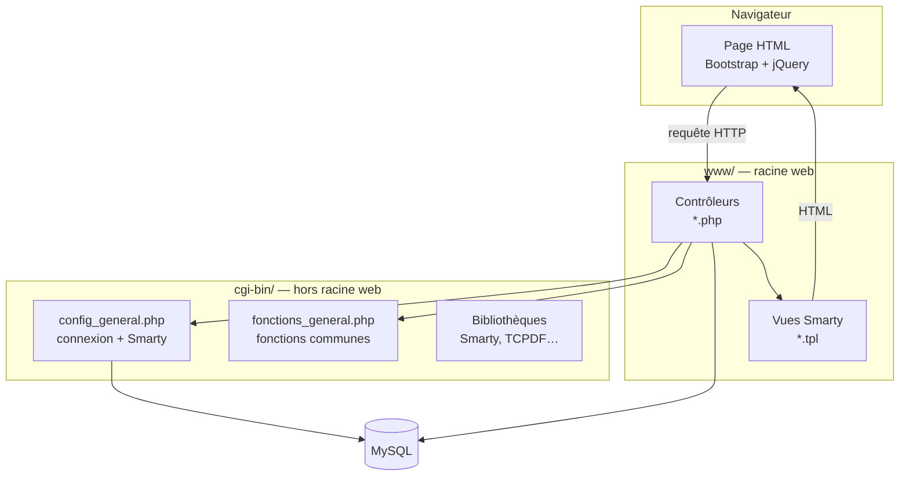
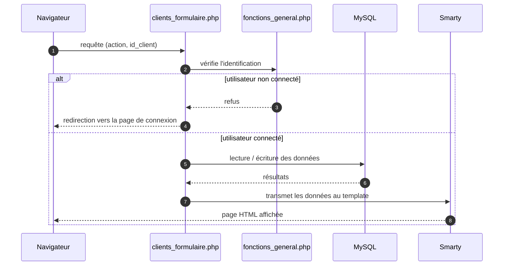

# Architecture

Ce document explique comment l'application est construite et comment une page
fonctionne, du clic de l'utilisateur à l'affichage du résultat.

## Une application sans framework

L'application est écrite en **PHP procédural**, sans framework ni routeur. Le
principe est simple : **chaque page de l'application correspond à un fichier
`.php`** dans le dossier `www/`. Ouvrir `clients_liste.php` dans le navigateur,
c'est exécuter le fichier du même nom.

Chaque fichier joue le rôle de **contrôleur** : il reçoit la requête, discute
avec la base de données, puis confie l'affichage à un **template** (une vue
Smarty). Les briques communes — connexion à la base, fonctions partagées — sont
rangées à part, dans `cgi-bin/`, hors de la racine web.



## Le démarrage d'une page

Tout fichier de `www/` commence par charger les deux briques communes :

```php
require_once('../cgi-bin/config/config_general.php');
require_once('../cgi-bin/config/fonctions_general.php');
```

- **`config_general.php`** ouvre la session, initialise le moteur de templates
  **Smarty** et établit la **connexion à la base MySQL** (via PDO, dans la
  variable `$connexion`).
- **`fonctions_general.php`** fournit une boîte à outils de fonctions réutilisées
  partout (authentification, menu, tri, pagination, suppression…).

## Le parcours d'une requête

Prenons l'exemple d'une fiche client. Voici ce qui se passe :



Chaque page vérifie donc **d'abord** que l'utilisateur est connecté avant de
faire quoi que ce soit — sinon elle le renvoie vers l'écran de connexion.

## La boîte à outils commune

Le fichier `fonctions_general.php` regroupe les fonctions utilisées par presque
toutes les pages :

| Fonction       | À quoi elle sert                                                                                 |
|----------------|--------------------------------------------------------------------------------------------------|
| Identification | Vérifie l'e-mail et le mot de passe, ouvre la session de l'utilisateur.                          |
| Menu & droits  | Construit le menu et détermine ce que l'utilisateur a le droit de voir.                          |
| Dates          | Convertit les dates entre le format base (`AAAA-MM-JJ`) et le format d'affichage (`JJ-MM-AAAA`). |
| Pagination     | Calcule le nombre de pages d'une liste.                                                          |
| Suppression    | Archive ou « supprime » un élément sans l'effacer réellement (voir ci-dessous).                  |
| Tri            | Mémorise la colonne de tri et la pagination choisies par chaque utilisateur.                     |

## Connexion et droits d'accès

L'authentification est « maison » : l'utilisateur saisit son e-mail et son mot de
passe sur la page de connexion, l'application vérifie ces informations en base et,
si tout est correct, ouvre une **session** contenant son identité et ses droits.

Les utilisateurs sont organisés en **groupes**, et chaque groupe possède différents droits :

- **Super-administrateur** : voit tout (éléments actifs, archivés, supprimés).
- **Groupe intermédiaire** : voit les éléments actifs et archivés.
- **Groupe standard** : voit uniquement les éléments actifs.

Le menu lui-même est piloté par la base de données : selon le groupe, certaines
entrées apparaissent ou non.

## Rien n'est jamais vraiment supprimé

L'application n'efface pas les données : elle utilise un système d'**états**.
Chaque élément (client, réservation, article…) porte un état :

- **Actif** — visible et utilisable ;
- **Archivé** — mis de côté, mais conservé ;
- **Supprimé** — masqué, mais toujours présent en base.

« Supprimer » un client revient donc à le passer à l'état *supprimé* : on peut
toujours le retrouver. C'est ce qu'on appelle une *suppression douce*.

## L'affichage : les templates Smarty

L'affichage est confié à **Smarty**, un moteur de templates. Les fichiers de vue
(`.tpl`) se trouvent dans `www/templates/`. Particularité du projet : les
variables dans les templates s'écrivent entre `<!--{` et `}-->` (par exemple
`<!--{ $nom_client }-->`) au lieu des accolades habituelles, pour éviter les
conflits avec le JavaScript et le CSS.

Des fragments communs (`header.tpl`, `footer.tpl`) sont réutilisés par toutes les
pages.

## Les documents PDF

Plusieurs pages (préfixées par `impressions_`) génèrent des documents PDF grâce à
la bibliothèque **TCPDF** : reçus de règlement, listes des réservations du jour,
bordereaux de retour, listes d'adhésions… Certains sont même produits
automatiquement et envoyés par e-mail (voir la tâche planifiée dans le
[README principal](../README.md)).

## Deux environnements dans un seul dépôt

Le dépôt contient **deux copies** de l'application :

- une pour la **production** (`www/` et `cgi-bin/`) ;
- une pour la **recette** — l'environnement de test (`recette/`).

Les deux partagent le même code ; seule la configuration de connexion à la base
change. Une correction de bug doit donc, en général, être appliquée **des deux
côtés**.
