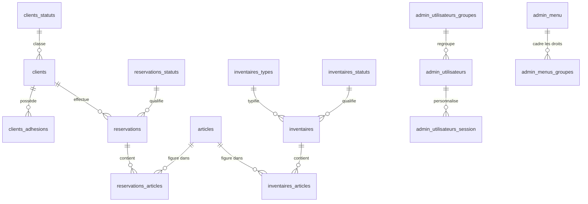

# Base de données

Ce document décrit les tables de l'application et la façon dont elles
s'articulent.

> ℹ️ **À savoir** : le dépôt ne contient pas de fichier d'export (dump) du schéma.
> Les informations ci-dessous ont été **reconstituées à partir des requêtes SQL**
> présentes dans le code. Les grandes lignes sont fiables, mais les types exacts
> des colonnes ne sont pas garantis. Ce document sera à compléter si un schéma
> officiel est retrouvé.

## Les grandes familles de tables

**Les données métier** — le cœur de l'activité :

- `clients` — les adhérents et clients ;
- `clients_adhesions` — leurs adhésions annuelles (un montant par année) ;
- `articles` — le catalogue de matériel prêtable ;
- `inventaires` et `inventaires_articles` — les fiches d'inventaire du stock ;
- `reservations` et `reservations_articles` — les réservations de matériel ;
- `fichiers` — les pièces jointes.

**Les tables de statuts** — des listes de valeurs :

- `clients_statuts`, `reservations_statuts`, `inventaires_statuts`,
  `inventaires_types`, `etats`.

**L'administration** — utilisateurs et coulisses :

- `admin_utilisateurs`, `admin_utilisateurs_groupes` — les comptes et leurs groupes ;
- `admin_menu`, `admin_menus_groupes` — le menu et les droits associés ;
- `admin_utilisateurs_session` — les préférences d'affichage de chaque utilisateur ;
- `log_cron` — le journal de la tâche planifiée.

## Comment les tables sont reliées

En résumé : un **client** possède des **adhésions** et effectue des
**réservations** ; une réservation porte sur des **articles** (avec une
quantité) ; les **inventaires** recensent eux aussi des articles. Côté
administration, chaque **utilisateur** appartient à un **groupe** qui définit ses
droits sur les entrées de **menu**.

## Colonnes principales des tables métier

Ces listes proviennent des instructions d'insertion trouvées dans le code.

**`clients`** — coordonnées de l'adhérent
`association`, `nom`, `prenom`, `adresse1`, `adresse2`, `adresse3`, `cp`,
`ville`, `telephone`, `email`, `commentaire`, `cle_client` (clé unique).

**`clients_adhesions`** — cotisation annuelle
`id_client`, `annee`, `montant`.

**`articles`** — matériel
`designation`, `commentaire`, `ordre_article` (ordre d'affichage).

**`reservations`** — prêt de matériel
`id_client`, `commentaire`, `don`, `date_don`, `date_depart`, `date_retour`,
`annee_reservation`.

**`reservations_articles`** — détail d'une réservation
`id_reservation`, `id_article`, `quantite_reservee`.

**`inventaires`** — fiche d'inventaire
`commentaire`, `date_inventaire`, plus son type et son statut.

## Les colonnes que l'on retrouve partout

La plupart des tables métier partagent le même « socle » de colonnes :

| Colonne | Rôle |
|---------|------|
| `id_<table>` | L'identifiant unique (clé primaire), par exemple `id_client`. |
| `date_creation`, `date_modification` | Suivi des dates de création et de dernière modification. |
| `id_membre_auteur` | L'utilisateur qui a fait la dernière modification. |
| `id_etat` | L'état de l'élément : actif, archivé ou supprimé (voir l'[architecture](architecture.md#rien-nest-jamais-vraiment-supprimé)). |
| `id_statut_…` | Un statut **métier**, propre à chaque type d'élément (distinct de l'état technique). |

Deux notions à ne pas confondre :

- **l'état** (`id_etat`) est technique et commun à tout : il dit si l'élément est
  actif, archivé ou supprimé ;
- **le statut** (`id_statut_client`, `id_statut_reservation`…) est métier : il
  décrit où en est l'élément dans son propre cycle de vie.
