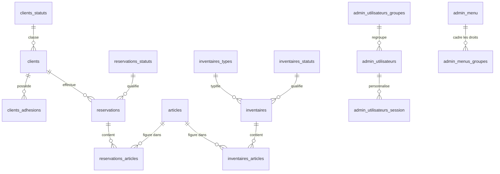

# Base de données

Ce document décrit les tables de l'application et la façon dont elles
s'articulent.

> ℹ️ Description établie à partir du **snapshot réel** de la base
> (`docker/initdb/cdfgenaytbbdd_mysql_db.sql`). Les types de colonnes indiqués
> sont ceux du schéma.

## Caractéristiques techniques

- **Moteur : MyISAM** pour toutes les tables → **pas de clés étrangères**, **pas de
  transactions**. Les relations décrites plus bas sont donc **logiques** : c'est le
  **code PHP** qui garantit la cohérence, pas la base.
- **Jeux de caractères mélangés** : la plupart des tables sont en `utf8mb3`, mais
  **`clients`, `clients_import` et `articles` sont en `latin1`**. C'est une source
  possible de soucis d'accents (à uniformiser un jour — voir la [roadmap](roadmap.md)).
- **Clés primaires** : la colonne `id_<table>` (ex. `id_client`) ; les
  `AUTO_INCREMENT`/`PRIMARY KEY` sont posés par des `ALTER TABLE` en fin de dump.

## Les grandes familles de tables

**Les données métier** — le cœur de l'activité :

- `clients` — les adhérents et clients ;
- `clients_adhesions` — leurs adhésions annuelles (un montant par année) ;
- `articles` — le catalogue de matériel prêtable ;
- `inventaires` et `inventaires_articles` — les fiches d'inventaire du stock ;
- `reservations` et `reservations_articles` — les réservations de matériel ;
- `fichiers` — les pièces jointes téléversées.

**Les tables de référence (statuts)** — des listes de valeurs :

- `etats` — l'état technique (actif / archivé / supprimé), commun à tout ;
- `clients_statuts`, `reservations_statuts`, `inventaires_statuts`, `inventaires_types`
  — les statuts métier propres à chaque entité.

**L'administration** — utilisateurs et coulisses :

- `admin_utilisateurs`, `admin_utilisateurs_groupes` — les comptes et leurs groupes ;
- `admin_menu`, `admin_menus_groupes` — le menu et les droits associés ;
- `admin_utilisateurs_session` — les préférences d'affichage de chaque utilisateur
  (colonnes, largeurs, tri, pagination) **par écran** ;
- `log_cron` — le journal de la tâche planifiée.

**Les tables techniques / de travail** — à ne pas confondre avec le métier :

- `clients_import` — table tampon pour l'import initial des clients (même structure
  que `clients`) ;
- `reservations_20241108`, `reservations_articles_20241108`, `savreservations`,
  `savreservations_articles` — **copies de sauvegarde manuelles** (datées ou
  préfixées `sav`), sans rôle dans l'application. Candidates à la suppression.

## Comment les tables sont reliées

Relations **logiques** (rappel : MyISAM, donc aucune clé étrangère réelle).

En résumé : un **client** possède des **adhésions** et effectue des
**réservations** ; une réservation porte sur des **articles** (avec une
quantité, via `reservations_articles`) ; les **inventaires** recensent eux aussi
des articles. Côté administration, chaque **utilisateur** appartient à un
**groupe** qui définit ses droits sur les entrées de **menu**.

## Colonnes principales des tables métier

**`clients`** *(latin1)* — coordonnées de l'adhérent
`id_client`, `association`, `nom`, `prenom`, `adresse1..3`, `cp`, `ville`,
`telephone`, `email`, `id_statut_client`, `commentaire`, `cle_client` (clé unique).

**`clients_adhesions`** — cotisation annuelle
`id_adhesion`, `id_client`, `annee`, `montant` (`float`).

**`articles`** *(latin1)* — matériel
`id_article`, `designation`, `commentaire`, `ordre_article` (ordre d'affichage).

**`reservations`** — prêt de matériel
`id_reservation`, `id_client`, `date_depart`, `date_retour`, `annee_reservation`,
`commentaire`, `don`, `date_don`, `id_statut_reservation`, `heure_modification`.

**`reservations_articles`** — détail d'une réservation (aucune clé primaire)
`id_reservation`, `id_article`, `quantite_reservee`.

**`inventaires`** — fiche d'inventaire
`id_inventaire`, `date_inventaire`, `commentaire`, `id_type_inventaire`,
`id_statut_inventaire`.

**`inventaires_articles`** — détail d'un inventaire (aucune clé primaire)
`id_inventaire`, `id_article`, `quantite_precedent`, `quantite_totale`, `commentaire`.

**`admin_utilisateurs`** — comptes
`id_utilisateur`, `nom_utilisateur`, `prenom_utilisateur`, `email_utilisateur`,
`mdp_utilisateur` (empreinte du mot de passe), `id_utilisateur_groupe`,
`items_par_page`, `cle_utilisateur`.

**`admin_utilisateurs_session`** — préférences d'affichage par utilisateur et par écran
`id_utilisateur`, `id_admin_menu`, `colonne`, `colonne_titre_fr`, `largeur`,
`ordre`, `sens_tri`, `items_par_page`, `tri_utilisateur`.

## Les colonnes que l'on retrouve partout

La plupart des tables métier partagent le même « socle » de colonnes :

| Colonne                              | Rôle                                                                                                                          |
|--------------------------------------|-------------------------------------------------------------------------------------------------------------------------------|
| `id_<table>`                         | L'identifiant unique (clé primaire), par exemple `id_client`.                                                                 |
| `date_creation`, `date_modification` | Suivi des dates de création et de dernière modification.                                                                      |
| `id_membre_auteur`                   | L'utilisateur ayant fait la **dernière** modification (pas d'historique complet — voir la [roadmap](roadmap.md)).             |
| `id_etat`                            | L'état de l'élément : actif, archivé ou supprimé (voir l'[architecture](architecture.md#rien-nest-jamais-vraiment-supprimé)). |
| `id_statut_…`                        | Un statut **métier**, propre à chaque type d'élément (distinct de l'état technique).                                          |

Deux notions à ne pas confondre :

- **l'état** (`id_etat`, table `etats`) est technique et commun à tout : il dit si
  l'élément est actif, archivé ou supprimé ;
- **le statut** (`id_statut_client`, `id_statut_reservation`…) est métier : il
  décrit où en est l'élément dans son propre cycle de vie.
