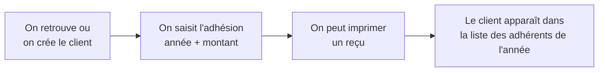
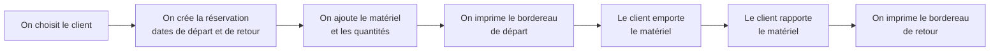
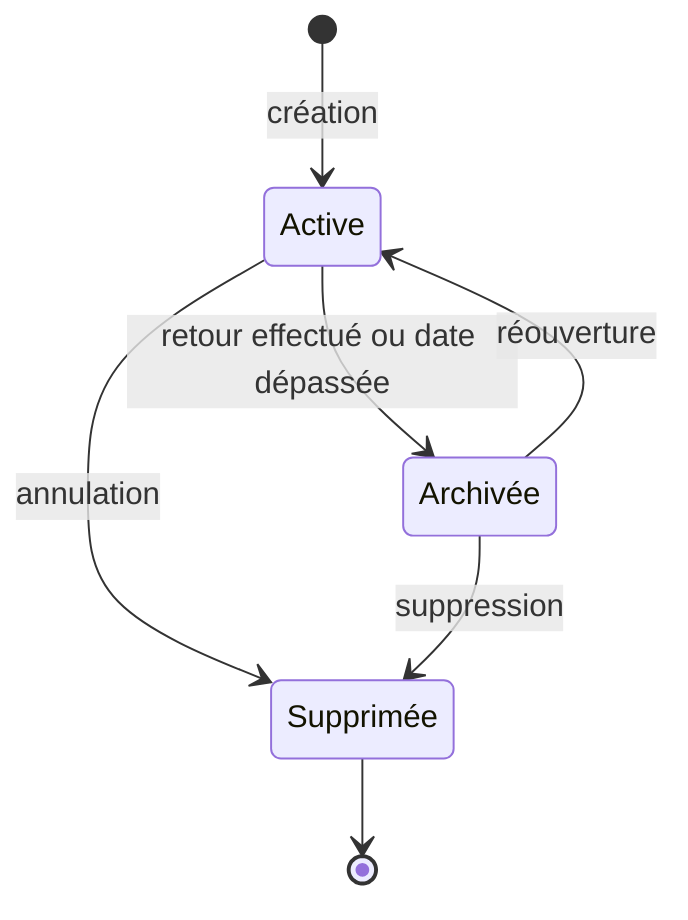

# Le métier

Ce document explique le contexte d'usage de l'application, sans jargon
technique.

## À quoi sert l'application

Un **comité des fêtes** est une association qui organise des animations locales
et met du **matériel** à disposition (tables, chaises, vaisselle, etc.), le plus
souvent en le prêtant ou le louant à ses adhérents pour leurs événements.

L'application sert à gérer tout cela au même endroit :

- les **adhérents** et leurs **adhésions** annuelles ;
- le **matériel** disponible et son **inventaire** ;
- les **réservations** de matériel, avec leurs dates de sortie et de retour ;
- les **documents** à imprimer (reçus, bordereaux, listes).

## Le vocabulaire

| Terme | Signification |
|-------|---------------|
| **Client / adhérent** | La personne ou l'association qui bénéficie du service. Chaque client possède une clé unique. |
| **Adhésion** | La cotisation payée pour une année donnée. Un même client cotise chaque année. |
| **Article** | Un type de matériel prêtable (une table, une chaise…). |
| **Inventaire** | Un état des stocks à une date donnée : quel matériel, en quelle quantité. |
| **Réservation** | La demande d'un client portant sur du matériel, avec une date de départ et une date de retour. |
| **Don** | Une somme offerte au comité, rattachée à une réservation. |
| **Règlement** | Un paiement (adhésion et/ou don), dont on peut éditer un reçu. |
| **Exercice** | L'année de référence utilisée pour les adhésions et les réservations. |

## Le parcours d'une adhésion

## Le parcours d'une réservation

C'est le cœur de l'application. Un client réserve du matériel, l'emporte, puis le
ramène.

Quand la **date de retour est dépassée**, une tâche automatique (exécutée chaque
nuit) met la réservation à jour et prévient l'équipe par e-mail. Voir la section
« Tâche planifiée » du [README principal](../README.md).

## Le cycle de vie d'une réservation

Une réservation passe par plusieurs états au fil du temps :

Rien n'est jamais réellement effacé : une réservation « supprimée » reste
consultable par les administrateurs.

## Où trouver quoi dans l'application

| Vous voulez… | Écran(s) concerné(s) |
|--------------|----------------------|
| Gérer les adhérents | Liste et fiche des clients |
| Enregistrer une adhésion | Fiche client |
| Gérer le matériel | Liste et fiche des articles |
| Faire un inventaire | Liste et fiche des inventaires |
| Créer/suivre une réservation | Liste et fiche des réservations |
| Imprimer un document | Écrans « impressions » (reçus, listes du jour, retours…) |
| Administrer les comptes | Écrans utilisateurs et groupes |

> Certains fichiers du dossier `www/` (noms commençant par `_`, ou contenant
> `test`/`example`) sont des scripts ponctuels ou d'essai, pas des écrans
> destinés aux utilisateurs.
