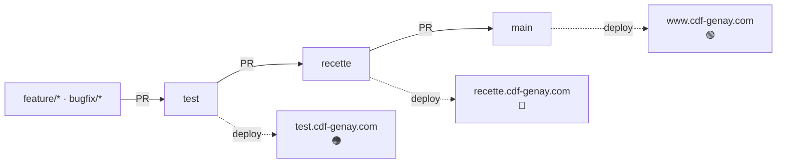

# Environnements et déploiement

Ce document explique **comment le même code sert trois environnements** (production,
recette, test) plus le développement local, **comment il est déployé sur OVH**, et
**comment diagnostiquer** les pannes déjà rencontrées. Il se veut lisible sans
connaître l'historique du projet.

---

## 1. Les quatre environnements

Il n'y a **qu'une seule copie du code** (`www/` + `cgi-bin/`). L'environnement est
déterminé automatiquement à l'exécution. Trois branches Git ont vocation à être
branchées sur trois hébergements OVH ; le quatrième environnement est le Docker local.

| Environnement  | Branche Git  | Adresse               | Base de données  | Thème           | Bandeau   |
|----------------|--------------|-----------------------|------------------|-----------------|-----------|
| **Production** | `main`       | www.cdf-genay.com     | base OVH prod    | 🟢 vert         | *(aucun)* |
| **Recette**    | `recette`    | recette.cdf-genay.com | base OVH recette | 🔵 bleu         | RECETTE   |
| **Test**       | `test`       | test.cdf-genay.com    | base OVH test    | 🟠 rouge/orange | TEST      |
| **Local**      | —            | localhost (Docker)    | base Docker      | 🟣 violet       | LOCAL     |

Le flux de travail visé : on développe sur une branche `feature/*` ou `bugfix/*`,
on fusionne (via Pull Request) dans `test`, puis `test` → `recette` → `main`.
Chaque fusion vers le haut déclenche le déploiement de l'environnement correspondant.

> **État actuel :** seul l'environnement **test** est effectivement relié à Git et
> déployé automatiquement. La **production** tourne encore sur son déploiement
> « classique » (voir §5). Brancher `recette` et `main` se fait via la procédure du §8.



---

## 2. Comment l'environnement est détecté

Tout se joue dans **`cgi-bin/config/environnement.php`**, sans aucun secret. Il
calcule une valeur parmi `prod` / `recette` / `test` / `local`, dans cet ordre :

1. **Variable d'environnement `CDF_ENV`** si elle est définie (c'est le cas en local,
   via `docker-compose.yml`). Elle sert aussi à *prévisualiser* un thème en local :
   mettre par ex. `CDF_ENV=recette` dans `.env` pour afficher le site local en bleu.
2. Sinon, **le nom d'hôte** de la requête :
   - `www.cdf-genay.com` (ou le domaine nu) → `prod`
   - `recette.cdf-genay.com` → `recette`
   - `test.cdf-genay.com` → `test`
   - `localhost` / `127.0.0.1` → `local`
3. Sinon (ex. tâche cron sans nom d'hôte) → `prod` par défaut (le cas le plus sûr :
   aucun bandeau affiché).

Le même code se comporte donc correctement partout, **sans configuration par branche**.

### Le thème (couleur)

`config_general.php` transmet l'environnement aux gabarits. Concrètement :

- la balise `<body>` reçoit un attribut `data-env="test"` (ou prod/recette/local) ;
- `www/css/styles.css` définit une variable CSS `--cdf-primaire` **par environnement** ;
- les classes historiques (`bg-vert`, `text-vert`, `btn-vert`…) utilisent cette
  variable — donc **aucun gabarit métier n'a été modifié**, seule la couleur change.

Un petit **bandeau** (pastille en bas à gauche) affiche l'environnement hors production.

---

## 3. Les identifiants de base de données

**Principe : les identifiants ne sont JAMAIS dans Git.** Seule la détection
d'environnement l'est. La résolution se fait dans **`cgi-bin/config/identifiants_bdd.php`**,
qui définit les constantes `serveur` / `bdd` / `utilisateur` / `mdp` selon deux sources :

1. **Variables d'environnement `CDF_DB_HOST` / `CDF_DB_NAME` / `CDF_DB_USER` /
   `CDF_DB_PASS`** — utilisées en **local** (injectées par `docker-compose.yml`). Aucun
   fichier à créer.
2. **Fichier `cgi-bin/config/config_secrets.php`** — utilisé sur **OVH**. Il est
   **hors Git** (voir `.gitignore`) et contient uniquement les 4 `define`. Modèle :
   `config_secrets.php.dist`.

Sur chaque hébergement OVH, on dépose donc **une fois** un `config_secrets.php` qui
ne contient que les identifiants **de ce serveur** :

```php
<?php
define('serveur',     "xxxxxxxx.mysql.db");  // hôte MySQL de la base
define('bdd',         "xxxxxxxx");           // nom de la base
define('utilisateur', "xxxxxxxx");
define('mdp',         "••••••••");
```

Comme ce fichier n'est pas suivi par Git, il **survit au déploiement automatique**
(le `git pull` d'OVH ne le touche pas) et chaque hébergement ne connaît que sa propre
base (bonne isolation prod / recette / test).

> La tâche planifiée `cgi-bin/reservations_maj_automatique.php` utilise le **même**
> mécanisme (elle inclut `identifiants_bdd.php`).

---

## 4. Le déploiement automatique OVH (Git)

Chaque hébergement OVH est relié au dépôt GitHub via l'intégration *Git* de l'espace
client (Hébergement → Git). À chaque `push` sur la branche, GitHub appelle un
**webhook** OVH qui déclenche un `git pull` côté serveur.

### Réglages du webhook GitHub → OVH

- **Content type : `application/json`** (obligatoire). En `x-www-form-urlencoded`,
  OVH répond `400 {"message":"invalid body"}` car il n'arrive pas à lire le corps.
- L'événement **`ping`** (envoyé une fois à la création du webhook) renvoie **toujours
  400** côté OVH — **c'est normal, on l'ignore**. Seul l'événement **`push`** compte
  (il doit renvoyer `200`).
- La branche doit **exister sur GitHub** avant le premier déploiement, sinon OVH
  échoue avec `fatal: Remote branch <x> not found`.

### ⚠️ Règle d'or : ne jamais *force-push* une branche déployée

OVH met à jour sa copie avec un **`git pull`**. Si on **réécrit l'historique** de
`test` / `recette` / `main` (squash + `git push --force`), le `pull` d'OVH ne peut
plus avancer et échoue :

```
fatal: refusing to merge unrelated histories
```

…et le déploiement reste bloqué à chaque push suivant. **Une branche déployée ne doit
avancer qu'en *fast-forward*** (nouveaux commits ou merges). Pour garder un historique
propre : squasher **avant** le premier push, ou faire un **squash-merge** depuis une
branche `feature/*` (la branche déployée ne reçoit alors que des merges, jamais de
réécriture).

**Réparer un déploiement bloqué par un force-push** : réinitialiser la copie locale
d'OVH — soit délier puis relier l'intégration Git (clone neuf), soit, en SSH :
`cd ~/<site> && git fetch origin <branche> && git reset --hard origin/<branche>`.

---

## 5. La structure des dossiers sur OVH

Point délicat : l'intégration Git d'OVH **clone le dépôt dans le dossier racine du
domaine**. Le *docroot* pointe donc sur la **racine du dépôt** (ex. `~/test`), alors
que la vraie racine web de l'application est le sous-dossier **`www/`**.

```
~/test/                ← dossier racine du domaine test (docroot) = racine du dépôt
├── .htaccess          ← réécrit toutes les requêtes vers www/
├── www/               ← vraie racine web (index.php, templates, css…)
│   └── .htaccess      ← DirectoryIndex index.php
└── cgi-bin/           ← config + fonctions (hors www/, atteint via ../cgi-bin)
```

Le **`.htaccess` à la racine** route donc en interne tout vers `www/` :

```apache
RewriteEngine On
RewriteRule ^www($|/) - [L]      # déjà dans www/ : ne rien faire
RewriteRule ^(.*)$ www/$1 [L]    # sinon : router vers www/
DirectoryIndex index.php
```

Cela fonctionne parce que **PHP place son répertoire de travail sur le script exécuté**
(`www/xxx.php`) : les chemins relatifs de l'appli (`../cgi-bin`, `templates/`) restent
donc valides. Effet de bord utile : les dossiers hors `www/` (`cgi-bin/`, `docker/`,
`.git/`…) ne sont pas servis (réécrits vers `www/` où ils n'existent pas → 404).

> Le site historique de **production** (`~/www`) est en disposition « classique »
> (docroot = `~/www` directement, `cgi-bin` au niveau du home). Le `.htaccess` racine
> ne le gêne pas ; il ne sert que les sites déployés par Git.

> En **local (Docker)**, le docroot est directement `www/` et `AllowOverride` est
> désactivé : ces `.htaccess` sont sans effet.

---

## 6. `.ovhconfig` et les containers PHP

Le fichier **`.ovhconfig`** (à la racine du dépôt, et un `~/.ovhconfig` par défaut sur
le compte) choisit le moteur PHP :

```ini
app.engine=php
app.engine.version=7.4
http.firewall=none
environment=production
container.image=stable64
```

`container.image` désigne **l'environnement d'exécution**, et chaque container embarque
une **liste figée de versions PHP** :

| `container.image` | Versions PHP disponibles      |
|-------------------|-------------------------------|
| `legacy`          | 5.4 → 7.0                     |
| `stable`          | 5.4 → 7.3                     |
| **`stable64`**    | **7.4 → 8.3** *(utilisé ici)* |

Deux règles à retenir :

- **On peut avoir une version PHP différente par site** (un `.ovhconfig` dans le dossier
  de chaque site), **mais le `container.image` doit être identique partout** sur un même
  hébergement. Mélanger `stable` et `stable64` → OVH n'arrive pas à servir → **erreur 501**.
- Le compte étant en `stable64`, le **plancher est PHP 7.4** (impossible d'utiliser 7.2/7.3).
  Pour tester une autre version sur `test`, garder `stable64` et changer seulement
  `app.engine.version` dans le `.ovhconfig` de la branche `test`.

---

## 7. Dépannage — pannes déjà rencontrées

| Symptôme                                                                                       | Cause                                                                                                              | Correctif                                                                                       |
|------------------------------------------------------------------------------------------------|--------------------------------------------------------------------------------------------------------------------|-------------------------------------------------------------------------------------------------|
| **501 « GET not supported for current URL »** sur toutes les URL (même les fichiers statiques) | `container.image` du site différent de celui du compte (`stable` vs `stable64`), ou version PHP indisponible (7.2) | Aligner `.ovhconfig` sur `container.image=stable64` + une version ≥ 7.4                         |
| **Webhook `push` → 400 `invalid body`**                                                        | Content type du webhook en `x-www-form-urlencoded`                                                                 | Passer le webhook en `application/json`                                                         |
| **Webhook `ping` → 400**                                                                       | Normal (OVH rejette le ping GitHub)                                                                                | À ignorer ; seul le `push` compte                                                               |
| **Déploiement `fatal: refusing to merge unrelated histories`**                                 | Force-push (réécriture d'historique) sur une branche déployée                                                      | Réinitialiser la copie OVH (délier/relier ou `git reset --hard`), puis **ne plus force-pusher** |
| **Déploiement `Remote branch <x> not found`**                                                  | La branche n'existe pas encore sur GitHub                                                                          | Pousser la branche avant de déployer                                                            |
| **Page « Configuration de la base de données manquante »**                                     | `config_secrets.php` absent sur le serveur                                                                         | Déposer `cgi-bin/config/config_secrets.php` (voir §3)                                           |
| **La racine `/` demande `/index.php`**                                                         | `DirectoryIndex` non défini                                                                                        | Fourni par les `.htaccess` (§5)                                                                 |

---

## 8. Brancher un nouvel environnement (recette, prod)

Marche à suivre, identique pour `recette` et `main` :

1. **La base OVH** de l'environnement existe (créée dans l'espace client, schéma importé).
2. Déposer sur le serveur `cgi-bin/config/config_secrets.php` avec les identifiants **de
   cette base** (§3).
3. Vérifier que le `.ovhconfig` déployé est en `container.image=stable64` + PHP ≥ 7.4 (§6).
   Il l'est déjà dans le dépôt ; il suivra au merge.
4. Les `.htaccess` de routage sont déjà versionnés (§5) : rien à faire.
5. Relier l'intégration **Git** OVH à la branche, **webhook en `application/json`** (§4).
6. **Ne jamais force-pusher** la branche.

Une fois ces points réunis, un `push` (fast-forward) sur la branche déploie
automatiquement, et le site s'affiche avec le thème de son environnement.

---

## Voir aussi

- [`../docker/README.md`](../docker/README.md) — l'environnement **local** (Docker) en
  détail : services, bases, `CDF_ENV`, phpMyAdmin.
- [`../README.md`](../README.md) — installation, configuration et vue d'ensemble du projet.
- [`architecture.md`](architecture.md) — comment une page fonctionne (contrôleur → vue).
